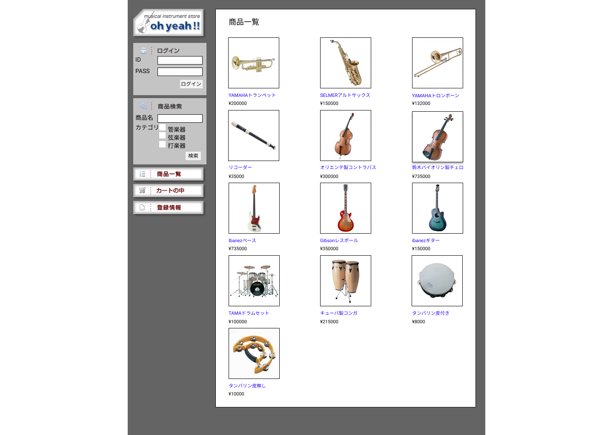

### 画面詳細図
## トップページ
### プロトタイプは以下のリンク先
[プロトタイプ](https://www.figma.com/file/pGXnXrKF6Coz5Tdb1IQtg1/Untitled?node-id=21%3A5)
*****

*****
補足：対応DBの列はDB設計後、○を対応するテーブル・カラム名に差し替えること。

| ID | 要素 | 内容 | アクション | イベント | 対応DB |
|----|-----|-----|---------|--------|-------|
|1   |バナー|サイト名|-　　　　　　　　　　　　　　　　|-　　　　　　　　　　　　　|-　　　　　　　　　　　　　|
